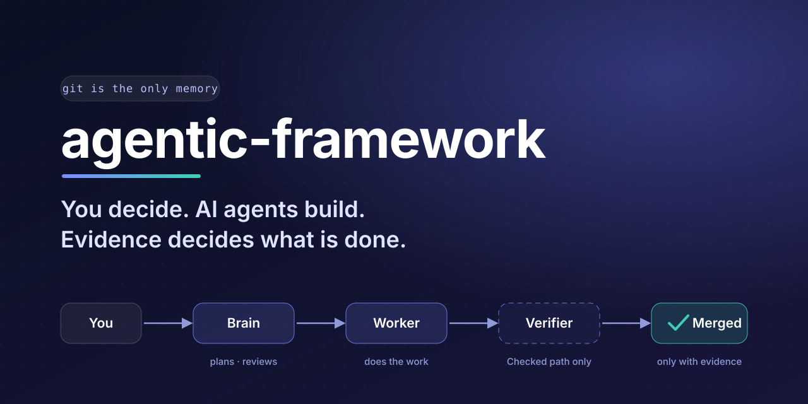
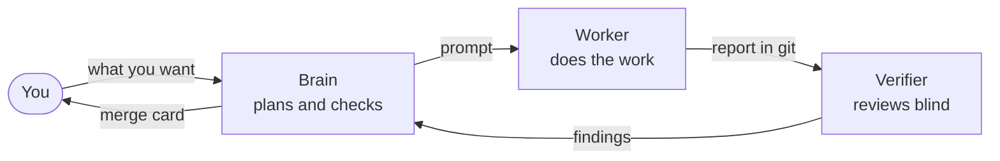

<p align="center">
  
</p>

<h1 align="center">agentic-framework</h1>

<p align="center"><strong>You decide. AI agents build. Evidence decides what is done.</strong></p>

<p align="center">
  <a href="https://github.com/cntrl-alt-lenny/agentic-framework/actions/workflows/ci.yml"></a>
  <a href="https://github.com/cntrl-alt-lenny/agentic-framework/releases"></a>
  <a href="https://github.com/cntrl-alt-lenny/agentic-framework/actions/workflows/ci.yml"></a>
  <a href="LICENSE"></a>
</p>

## What is this?

A small operating model for building projects with AI agents when the person in
charge is not a programmer. You say what you want. A **Brain** agent plans the
work and checks it, a **Worker** does it, and an optional **Verifier** reviews it
blind. Nothing counts as done until the evidence shows it, and everything lives
in git, so work started in one tool or on one machine can finish on another,
even weeks later.



## Quick start

1. From a clone of this repository, install it into your project:

   ```bash
   python3 tools/adopt.py <your-project> --project "My Project" --adapter claude-code
   ```

2. Write your project's own rules in its `AGENTS.md`.
3. Open a fresh chat in the project and paste the start prompt from
   [FRAMEWORK.md](framework/FRAMEWORK.md#the-round). The Brain writes every
   prompt after that.
4. Coming back after a break? `python3 tools/fw.py status` ends with a `next:`
   line saying exactly what to send.

## What works

- **Where am I?** One command shows each round seat by seat, and your next action.
- **Any tool, any machine.** Claude Code, Codex, Gemini or any tool that runs
  git and Python 3.9+, on Windows, macOS and Linux.
- **Independent review.** The Verifier reviews the exact commit blind; the
  Brain re-checks at least one claim itself.
- **Safe updates.** Projects see new releases on their own, and an update never
  overwrites a file you edited.
- **Honest limits.** It guides agents; it cannot force them. That is why every
  claim needs evidence.

<details>
<summary><strong>What a project gets</strong></summary>

| File | What it is |
|---|---|
| `AGENTS.md` | The project's own rules and its merge rule. Every tool reads this first. |
| `docs/agents/FRAMEWORK.md` | The operating model: the rules, the round, tiers, reports, updates. |
| `docs/agents/roles/` | One short card each for Brain, Worker and Verifier. |
| `docs/state.md` | The owner's standing decisions. Short, and checked to stay short. |
| `docs/rounds/<id>/` | One folder per round: the brief and each seat's committed report. |
| `tools/fw.py` | The one tool: `status`, `start`, `report`, `delivery`, `prompt`, `check`. |
| `docs/agents/framework.json` | The pinned release and a fingerprint of every framework file. |

</details>

<details>
<summary><strong>What is in this repository</strong></summary>

| Folder | What it holds |
|---|---|
| [`framework/`](framework/) | Exactly what projects copy: the core and the three role cards. |
| [`tools/`](tools/) | `fw.py` (installed into projects) and `adopt.py` (installs and updates). |
| [`templates/`](templates/) | Starting versions of the project-owned files. |
| [`adapters/`](adapters/) | Optional pointer files for particular tools. |
| [`docs/`](docs/) | This repository's own state, rounds and feedback process. |
| [`history/`](history/) | The failures and case studies the framework grew from. |
| [`tests/`](tests/) | Whole rounds run across separate clones, and a 2.x project migrated. |

</details>

## Documentation

- [The operating model](framework/FRAMEWORK.md) and the [role cards](framework/roles/)
- [Which tool can hold which seat](adapters/README.md)
- [What changed in each release](CHANGELOG.md)
- [Reporting a problem or an idea](https://github.com/cntrl-alt-lenny/agentic-framework/issues/new/choose), and [how feedback becomes a release](docs/feedback.md)
- [The README house style](standards/readme.md)

## Credits and license

MIT. See [LICENSE](LICENSE). Tool names are trademarks of their owners.
